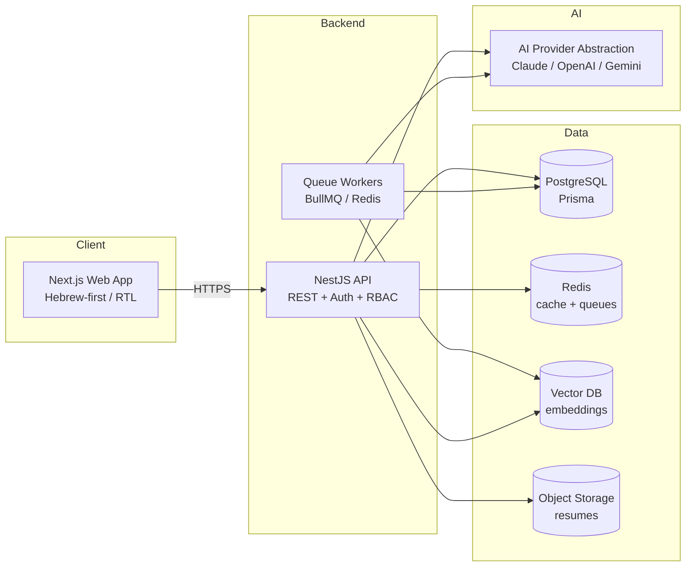

# Architecture

This document describes the target architecture for **AI Job Agent Israel**. It is a
living document; each milestone may add an ADR (Architecture Decision Record) below.

## Principles

- **Clean architecture** — strict separation of UI, business logic, data, AI, and
  infrastructure layers.
- **SOLID** — small, focused services; composition over inheritance.
- **Provider abstractions** — AI providers, job sources, storage, email, and vector DB
  sit behind interfaces so implementations can be swapped without touching callers.
- **Hebrew-first / RTL** — the default experience is Hebrew with full right-to-left
  layout; English is fully supported.
- **Israel-only domain** — locations, salaries, date formats, and recruitment norms
  target the Israeli market.
- **Scalability** — stateless API, background queue workers, caching, and vector search
  designed to scale horizontally.

## High-level components

## Layered structure (per app/service)

| Layer              | Responsibility                                            |
| ------------------ | --------------------------------------------------------- |
| **UI**             | Presentation, RTL/i18n, accessibility (web only)          |
| **Business logic** | Use cases, domain rules (matching, scoring, coaching)     |
| **AI layer**       | Provider-agnostic prompts, embeddings, RAG orchestration  |
| **Data layer**     | Repositories, Prisma models, queries                      |
| **Infrastructure** | Storage, email, queues, external integrations             |
| **Configuration**  | Env parsing, feature flags, secrets                       |
| **Utilities**      | Pure helpers, formatting (Israeli dates/locations/salary) |

## Provider abstractions

Each external capability is defined by an interface with pluggable implementations:

- `AiProvider` → `OpenAiProvider`, `AnthropicProvider`, `GeminiProvider`
- `JobSource` → per-source adapters (official APIs / feeds; compliance-gated)
- `StorageProvider` → S3-compatible, local
- `EmailProvider` → console (dev), transactional (prod)
- `VectorStore` → embeddings persistence + similarity search

## Matching & explainability

Matching is **semantic**, never keyword comparison. For each job the engine produces
scored dimensions (overall, experience, skills, technology, industry, culture, growth,
salary, location, remote, career progression, learning opportunity, interview
probability, confidence) — **each with a human-readable explanation** and a ranking by
real likelihood of getting hired.

## Compliance & security

- Respect `robots.txt`, site terms, API licensing, copyright; prefer official sources.
- Encrypted resume storage; malware scanning on upload; input validation at boundaries.
- Secure auth (JWT access/refresh), RBAC, audit logs, rate limiting.
- GDPR-ready data handling.

## Decision records

_ADRs will be appended here as decisions are made (e.g., vector DB choice, queue
technology, AI default provider)._
